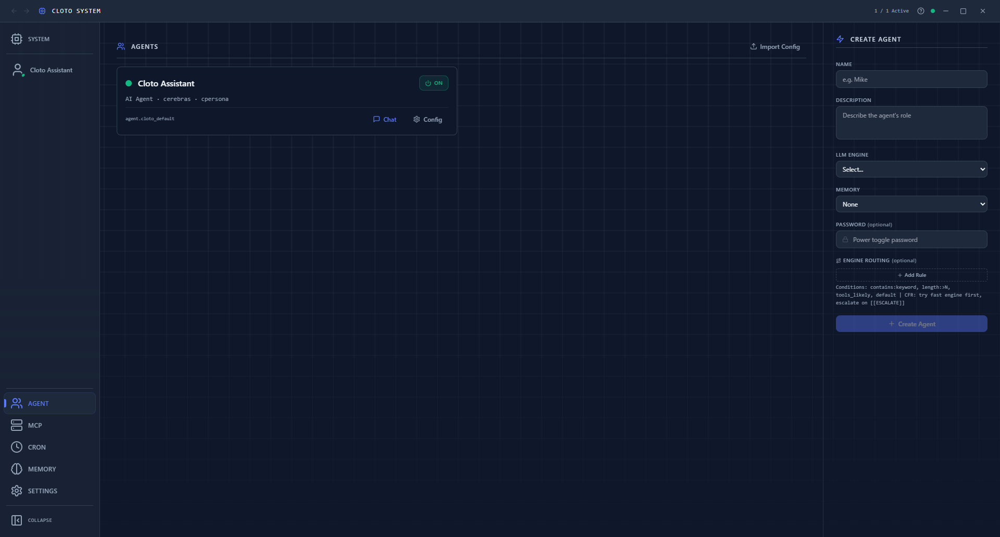
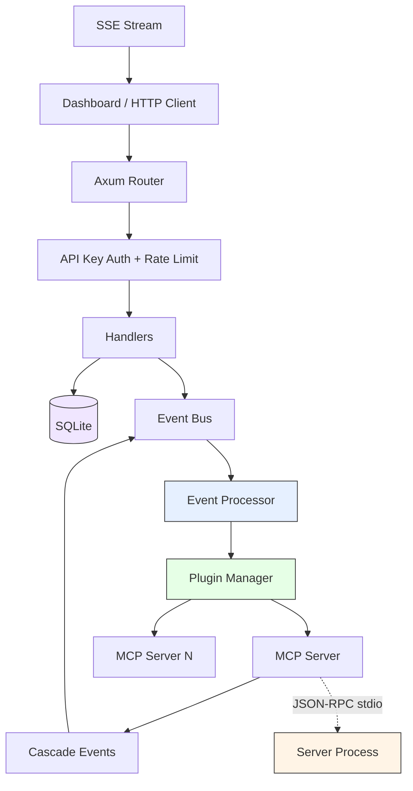

<div align="center">

# ClotoCore

### Build Your Own AI Partner

An open-source AI container platform written in Rust.
Sandboxed plugins, GUI dashboard, and your AI stays on your machine.

[]()
[](LICENSE)

[Documentation](docs/ARCHITECTURE.md) · [Vision](docs/PROJECT_VISION.md)

</div>

---

## What is ClotoCore?

ClotoCore is a platform for building advanced AI agents — not chatbots, not assistants, but **AI partners** with personality, capabilities, and memory.

Inspired by projects like [Neuro-Sama](https://www.twitch.tv/vedal987), ClotoCore lets anyone construct sophisticated AI systems through a plugin architecture and GUI dashboard, without writing a single line of code.

**AI Container** = Plugin Set + Personality Definition + Capability Set

```
Example: "VTuber AI" Container          Example: "Research Assistant" Container
├── reasoning: DeepSeek                  ├── reasoning: Claude / GPT-4o
├── vision: Screen capture plugin        ├── tools: File search, Web search
├── personality: Character definition    ├── personality: Academic, precise
├── voice: TTS/STT plugin               └── memory: Long-term memory plugin
└── avatar: Live2D/VRM plugin
```

<div align="center">



</div>

## Why ClotoCore?

|  | ClotoCore | Chat-based AI frameworks |
|--|------|--------------------------|
| **Language** | Rust — memory safe, fast, low resource | TypeScript / Python |
| **Security** | Sandboxed plugins, permission isolation, host whitelisting, DNS rebinding protection | Broad local permissions |
| **Interface** | GUI dashboard + Tauri desktop app | Chat / CLI only |
| **Design** | Plugin-composed AI containers | Monolithic agents |
| **Extension** | MCP server plugins (any language) | Single language |

## Architecture



**Key design principles:**

- **Core Minimalism** — The kernel is a stage, not an actor. All intelligence lives in plugins.
- **Event-First** — Plugins communicate through an async event bus, never directly.
- **Capability Injection** — Plugins cannot instantiate network clients. The kernel injects pre-authorized, sandboxed capabilities.
- **Human-in-the-Loop** — Sensitive operations require explicit admin approval at runtime.

## Quick Start

```bash
git clone https://github.com/Cloto-dev/ClotoCore.git
cd ClotoCore
# build dashboard first
npm --prefix dashboard ci && npm --prefix dashboard run build
cargo build --release
cargo run --package cloto_core
```

The dashboard opens at **http://localhost:8081**.

## MCP Servers

All plugin functionality is delivered via **MCP (Model Context Protocol)** servers:

| Server | Type | Description |
|--------|------|-------------|
| `mind.deepseek` | Reasoning | Advanced reasoning via DeepSeek API |
| `mind.cerebras` | Reasoning | Ultra-high-speed reasoning via Cerebras API |
| `mind.claude` | Reasoning | Anthropic Claude API (native Messages API) |
| `mind.ollama` | Reasoning | Local model inference via Ollama |
| `memory.cpersona` | Memory | Persistent memory with FTS5 search + vector embedding |
| `tool.terminal` | Tool | Sandboxed shell command execution |
| `tool.agent_utils` | Tool | Deterministic utilities (time, math, UUID, hash, etc.) |
| `tool.cron` | Tool | Stateless CRON job management via kernel REST API |
| `tool.embedding` | Tool | Vector embedding generation (local ONNX MiniLM) |
| `tool.websearch` | Tool | Web search via Tavily or SearXNG |
| `tool.research` | Tool | Multi-engine research synthesis pipeline |
| `tool.imagegen` | Tool | Image generation via Stable Diffusion API |
| `vision.gaze_webcam` | Vision | Eye gaze tracking via MediaPipe |
| `vision.capture` | Vision | Screen/image analysis via Ollama (hybrid OCR) |
| `voice.stt` | Voice | Speech-to-text via Whisper |
| `voice.tts` | Voice | Text-to-speech via pyttsx3 |

MCP servers are configured via `mcp.toml` and can be written in any language.
See [MCP Plugin Architecture](docs/MCP_PLUGIN_ARCHITECTURE.md) for details.

## Project Structure

```
crates/core/        Kernel — event bus, MCP manager, HTTP API, rate limiter
crates/shared/      Plugin SDK — traits, capability injection, event types, LLM utilities
mcp-servers/        MCP servers (Python): 16 servers across mind, memory, tool, vision, voice
dashboard/          React/TypeScript web UI (Tauri desktop app)
scripts/            Build tools, verification scripts
qa/                 Issue registry and quality assurance data
docs/               Architecture, vision, specs, design documents
```

## Configuration

Copy `.env.example` to `.env` to customize. All settings have sensible defaults.

| Variable | Default | Description |
|----------|---------|-------------|
| `PORT` | `8081` | HTTP server port |
| `CLOTO_API_KEY` | (none) | Admin API key (required in release builds) |
| `DEEPSEEK_API_KEY` | (none) | DeepSeek API key |
| `CEREBRAS_API_KEY` | (none) | Cerebras API key |
| `EMBEDDING_API_KEY` | (none) | Embedding API key (OpenAI-compatible) |
| `BIND_ADDRESS` | `127.0.0.1` | Server bind address |
| `ALLOWED_HOSTS` | (none) | Network whitelist for plugin HTTP access |
| `MAX_EVENT_DEPTH` | `10` | Maximum event cascading depth |
| `RUST_LOG` | `info` | Log level filter |

<details>
<summary>All configuration variables</summary>

| Variable | Default | Description |
|----------|---------|-------------|
| `PORT` | `8081` | HTTP server port |
| `DATABASE_URL` | `sqlite:{exe_dir}/data/cloto_memories.db` | SQLite database path |
| `CLOTO_API_KEY` | (none) | Admin API key (required in release builds) |
| `DEEPSEEK_API_KEY` | (none) | DeepSeek API key |
| `CEREBRAS_API_KEY` | (none) | Cerebras API key |
| `CONSENSUS_ENGINES` | `mind.deepseek,mind.cerebras` | Engine IDs for consensus mode |
| `DEFAULT_AGENT_ID` | `agent.cloto_default` | Default agent for `/api/chat` |
| `EMBEDDING_API_KEY` | (none) | Embedding API key (OpenAI-compatible) |
| `CLOTO_SKIP_ICON_EMBED` | (none) | Set to `1` to skip icon embedding during dev builds |
| `RUST_LOG` | `info` | Log level filter |
| `MAX_EVENT_DEPTH` | `10` | Maximum event cascading depth |
| `PLUGIN_EVENT_TIMEOUT_SECS` | `120` | Plugin event handler timeout (1-300) |
| `CORS_ORIGINS` | `localhost:5173` | Allowed CORS origins (comma-separated) |
| `ALLOWED_HOSTS` | (none) | Network whitelist for plugin access |
| `BIND_ADDRESS` | `127.0.0.1` | Server bind address (`0.0.0.0` for network access) |
| `MEMORY_CONTEXT_LIMIT` | `10` | Maximum memory entries returned per recall |
| `EVENT_HISTORY_SIZE` | `1000` | Maximum events kept in memory |
| `EVENT_RETENTION_HOURS` | `24` | Hours to retain events before cleanup (1-720) |
| `CLOTO_MAX_AGENTIC_ITERATIONS` | `16` | Maximum tool-use loop iterations (1-64) |
| `CLOTO_MCP_CONFIG` | (none) | Path to mcp.toml configuration file |
| `CLOTO_TOOL_TIMEOUT_SECS` | `30` | Tool execution timeout in seconds (1-300) |
| `HEARTBEAT_INTERVAL_SECS` | `30` | Agent heartbeat ping interval |
| `CLOTO_SDK_SECRET` | (none) | MCP SDK authentication secret |
| `CLOTO_YOLO` | `false` | Skip permission confirmations (dev/testing) |
| `CLOTO_CRON_ENABLED` | `true` | Enable cron job scheduler |
| `CLOTO_CRON_INTERVAL` | `60` | Cron check interval in seconds |
| `CLOTO_LLM_PROXY_PORT` | `8082` | LLM API proxy port |
| `CONSENSUS_SYNTHESIZER` | (none) | Consensus synthesis engine ID |
| `CONSENSUS_MIN_PROPOSALS` | `2` | Minimum proposals before synthesis |
| `CONSENSUS_SESSION_TIMEOUT_SECS` | `60` | Consensus session timeout |
| `CLOTO_EVENT_CONCURRENCY` | `50` | Event processing concurrency limit (1-500) |
| `CLOTO_MAX_EVENT_HISTORY` | `10000` | Maximum event history buffer (100-1000000) |
| `CLOTO_DB_TIMEOUT_SECS` | `10` | Database operation timeout (1-120) |
| `CLOTO_MEMORY_TIMEOUT_SECS` | `5` | Memory retrieval timeout (1-60) |
| `CLOTO_HEARTBEAT_THRESHOLD_MS` | `90000` | Agent heartbeat threshold (10000-600000) |
| `CLOTO_MCP_REQUEST_TIMEOUT_SECS` | `120` | MCP request timeout (10-600) |
| `CLOTO_LLM_PROXY_TIMEOUT_SECS` | `180` | LLM proxy HTTP timeout (30-600) |
| `CLOTO_RATE_LIMIT_PER_SEC` | `10` | Rate limit requests/sec (1-1000) |
| `CLOTO_RATE_LIMIT_BURST` | `20` | Rate limit burst size (1-10000) |
| `CLOTO_MAX_CHAT_QUERY_LIMIT` | `200` | Max chat messages per query (10-10000) |
| `CLOTO_ATTACHMENT_INLINE_THRESHOLD` | `65536` | Attachment inline threshold in bytes (0-10485760) |
| `CLOTO_UPDATE_REPO` | `Cloto-dev/ClotoCore` | GitHub repo for update checks |
| `CLOTO_MAX_CRON_GENERATION` | (none) | Maximum cron recursion depth |
| `CLOTO_CRON_DEFAULT_MAX_ITERATIONS` | `8` | Default max iterations for cron jobs (1-64) |
| `TAVILY_API_KEY` | (none) | Tavily search API key |
| `OLLAMA_MODEL` | (none) | Ollama model name |
| `OLLAMA_ENABLE_THINKING` | (none) | Enable Ollama thinking mode |

</details>

## API

<details>
<summary>Public endpoints</summary>

| Method | Path | Description |
|--------|------|-------------|
| GET | `/api/system/version` | Current version info |
| GET | `/api/system/health` | Lightweight health check |
| GET | `/api/events` | SSE event stream |
| GET | `/api/history` | Event history |
| GET | `/api/metrics` | System metrics |
| GET | `/api/memories` | Memory entries |
| DELETE | `/api/memories/:id` | Delete memory entry |
| GET | `/api/episodes` | Episode archive entries |
| DELETE | `/api/episodes/:id` | Delete episode entry |
| GET | `/api/plugins` | Plugin list with manifests |
| GET | `/api/plugins/:id/config` | Plugin configuration |
| GET | `/api/agents` | Agent configurations |
| GET | `/api/permissions/pending` | Pending permission requests |
| GET | `/api/mcp/access/by-agent/:agent_id` | Agent MCP tool access |

</details>

<details>
<summary>Admin endpoints (requires X-API-Key header)</summary>

| Method | Path | Description |
|--------|------|-------------|
| POST | `/api/system/shutdown` | Graceful shutdown |
| POST | `/api/system/invalidate-key` | Revoke API key |
| POST | `/api/plugins/apply` | Bulk enable/disable plugins |
| POST | `/api/plugins/:id/config` | Update plugin config |
| GET | `/api/plugins/:id/permissions` | Query plugin permissions |
| POST | `/api/plugins/:id/permissions/grant` | Grant permission to plugin |
| DELETE | `/api/plugins/:id/permissions` | Revoke plugin permission |
| POST | `/api/agents` | Create agent |
| POST | `/api/agents/:id` | Update agent |
| DELETE | `/api/agents/:id` | Delete agent |
| POST | `/api/agents/:id/power` | Toggle agent power state |
| GET/POST/DELETE | `/api/agents/:id/avatar` | Agent avatar management |
| POST | `/api/commands/:id/approve\|trust\|deny` | Command approval decisions |
| POST | `/api/events/publish` | Publish event to bus |
| POST | `/api/permissions/:id/approve` | Approve a request |
| POST | `/api/permissions/:id/deny` | Deny a request |
| POST | `/api/chat` | Send message to agent |
| GET/POST/DELETE | `/api/chat/:agent_id/messages` | Chat message persistence |
| GET | `/api/chat/attachments/:attachment_id` | Retrieve chat attachment |
| GET/POST | `/api/cron/jobs` | List/create cron jobs |
| DELETE | `/api/cron/jobs/:id` | Delete cron job |
| POST | `/api/cron/jobs/:id/toggle` | Enable/disable cron job |
| POST | `/api/cron/jobs/:id/run` | Manually trigger cron job |
| GET | `/api/llm/providers` | List LLM providers |
| POST | `/api/llm/providers/:id/key` | Set LLM provider API key |
| DELETE | `/api/llm/providers/:id/key` | Remove LLM provider API key |
| GET/POST | `/api/mcp/servers` | List/create MCP servers |
| DELETE | `/api/mcp/servers/:name` | Delete MCP server |
| GET/PUT | `/api/mcp/servers/:name/settings` | Server settings |
| GET/PUT | `/api/mcp/servers/:name/access` | Access control |
| POST | `/api/mcp/servers/:name/start\|stop\|restart` | Server lifecycle |
| POST | `/api/mcp/call` | Call MCP tool directly |
| POST | `/api/chat/:agent_id/messages/:message_id/retry` | Retry agent response |
| GET/PUT | `/api/settings/yolo` | YOLO mode (skip permission prompts) |
| GET/PUT | `/api/settings/max-cron-generation` | Max cron recursion depth |

</details>

## Testing

163 tests (Rust 98 + Python 65).

```bash
cargo test                              # all Rust tests
cargo test --package cloto_core          # kernel only
cargo test --test '*'                   # integration tests only

cd mcp-servers && .venv/Scripts/python -m pytest tests/ -v  # Python MCP tests
```

## Security

- **API key authentication** with per-IP rate limiting (10 req/s, burst 20)
- **Append-only audit log** in SQLite for all permission decisions
- **Minimal default permissions** — elevated permissions require human approval
- **Network host whitelisting** with DNS rebinding protection
- **MCP access control** with 3-level RBAC (capability → server → tool)

See [Architecture](docs/ARCHITECTURE.md) for the full security model.

## Documentation

- [Architecture](docs/ARCHITECTURE.md) — Design principles, event flow, security model
- [Project Vision](docs/PROJECT_VISION.md) — Strategic direction and roadmap
- [Development](docs/DEVELOPMENT.md) — Coding standards, guardrails, PR process
- [MGP Spec](docs/MGP_SPEC.md) — Model Gateway Protocol specification
- [MGP Guide](docs/MGP_GUIDE.md) — MGP usage guide
- [MGP Security](docs/MGP_SECURITY.md) — MGP security model
- [MGP Isolation](docs/MGP_ISOLATION_DESIGN.md) — MGP isolation design
- [MGP Communication](docs/MGP_COMMUNICATION.md) — MGP communication protocol
- [MGP Discovery](docs/MGP_DISCOVERY.md) — MGP service discovery
- [MGP Implementation Roadmap](docs/MGP_IMPLEMENTATION_ROADMAP.md) — MGP implementation roadmap
- [MCP Architecture](docs/MCP_PLUGIN_ARCHITECTURE.md) — MCP server communication protocol
- [CPersona Memory](docs/CPERSONA_MEMORY_DESIGN.md) — Memory system design
- [Discord Bridge](docs/DISCORD_BRIDGE_DESIGN.md) — Discord integration design
- [Database Schema](docs/SCHEMA.md) — SQLite schema reference
- [Changelog](docs/CHANGELOG.md) — Development history

## License

**Business Source License 1.1** — converts to **MIT** on 2028-02-14.

You can freely use ClotoCore for plugin development, internal tools, consulting, education, and small-scale commercial projects. Large-scale commercial deployment (>$100k revenue, >1,000 users, >50 employees, or SaaS) requires prior approval. See [LICENSE](LICENSE) for the full terms.

## Community

- [GitHub Issues](https://github.com/Cloto-dev/ClotoCore/issues)
- [GitHub Discussions](https://github.com/Cloto-dev/ClotoCore/discussions)
- [X (Twitter)](https://x.com/cloto_dev)

## Credits

- **VOICEVOX** — Text-to-speech engine used for avatar voice synthesis. Default speaker: **VOICEVOX:ナースロボ＿タイプＴ**
  - [VOICEVOX](https://voicevox.hiroshiba.jp/) — [Terms of Use](https://voicevox.hiroshiba.jp/term/)
  - Individual character terms may apply depending on the selected speaker.

## Note

Built by a solo developer from Japan. Most of the code and documentation in this project was written with the assistance of AI. If you find any issues, please open an [issue](https://github.com/Cloto-dev/ClotoCore/issues).
