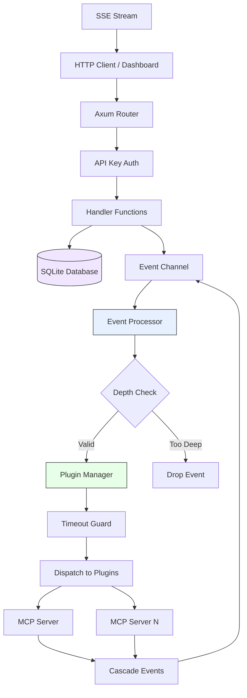

# ClotoCore Architecture

ClotoCore is an AI agent platform designed with a high degree of flexibility, safety, and extensibility. This document provides an integrated definition of design principles, the security framework, plugin communication mechanisms, and sub-project specifications.

---

## 0. System Overview

### 0.1 High-Level Architecture



### 0.2 Request Flow

```
Client Request
  │
  ├─ GET /api/agents ──────────────────► get_agents() ──► DB Query ──► JSON Response
  ├─ POST /api/chat ────► check_auth() ──► chat_handler() ──► Event Bus ──► Plugin Processing
  ├─ GET /api/events/stream ───────────► sse_handler() ──► Broadcast Subscribe ──► SSE Stream
  └─ POST /api/plugins/:id/permissions ► check_auth() ──► grant_permission() ──► Event + Audit Log
```

### 0.3 Event Processing Pipeline

```
1. Event Injected (HTTP handler / plugin cascade / system)
       │
2. EnvelopedEvent wraps event with source_plugin_id + trace_id
       │
3. Event Channel (mpsc) buffers event
       │
4. Event Processor loop:
   ├── Depth check (max 5 levels, prevents infinite cascade)
   ├── Broadcast to SSE subscribers
   ├── Save to event history ring buffer
   └── Dispatch to Plugin Manager
           │
5. Plugin Manager:
   ├── Filter active plugins
   ├── Apply timeout guard (per-plugin)
   └── Call plugin.on_event() concurrently
           │
6. Plugin responses may generate cascade events → back to step 1
```

### 0.4 Crate Structure

```
ClotoCore/
├── crates/
│   ├── core/          # Kernel: HTTP server, handlers, event loop, database
│   │   └── src/
│   │       ├── handlers.rs      # Handler routing module (re-exports sub-handlers)
│   │       ├── handlers/        # HTTP API sub-handlers
│   │       │   ├── system.rs    #   Agentic loop, chat pipeline, delegation
│   │       │   ├── mcp.rs       #   MCP server management endpoints
│   │       │   ├── agents.rs    #   Agent CRUD, avatar, power toggle
│   │       │   ├── chat.rs      #   Chat message persistence
│   │       │   ├── cron.rs      #   CRON job management
│   │       │   ├── commands.rs  #   Command approval (HITL)
│   │       │   ├── permissions.rs # Permission approval/denial
│   │       │   ├── events.rs    #   SSE event stream
│   │       │   ├── llm.rs       #   LLM proxy endpoints
│   │       │   ├── assets.rs    #   Static asset serving
│   │       │   ├── response.rs  #   ok_data() / json_data() helpers
│   │       │   └── utils.rs     #   Validation, password verification
│   │       ├── db/              # SQLite persistence layer
│   │       │   ├── mod.rs       #   Schema, migrations, core queries
│   │       │   ├── mcp.rs       #   MCP server state, access control
│   │       │   ├── chat.rs      #   Chat message storage
│   │       │   ├── permissions.rs # Permission requests
│   │       │   ├── cron.rs      #   CRON job persistence
│   │       │   ├── audit.rs     #   Audit log queries
│   │       │   ├── api_keys.rs  #   API key management
│   │       │   ├── llm.rs       #   LLM routing rules
│   │       │   └── trusted_commands.rs # Command trust store
│   │       ├── managers/        # Runtime managers
│   │       │   ├── mod.rs       #   Module declarations
│   │       │   ├── mcp.rs       #   McpClientManager (server orchestration)
│   │       │   ├── mcp_client.rs #  JSON-RPC client per MCP server
│   │       │   ├── mcp_types.rs #   Shared MCP types (McpServerHandle, etc.)
│   │       │   ├── mcp_protocol.rs # MCP JSON-RPC message types
│   │       │   ├── mcp_transport.rs # stdio transport layer
│   │       │   ├── mcp_kernel_tool.rs # create_mcp_server tool
│   │       │   ├── mcp_tool_validator.rs # Code security validation
│   │       │   ├── mcp_health.rs #  Server health monitor + auto-restart
│   │       │   ├── mcp_venv.rs  #   Python venv auto-setup
│   │       │   ├── registry.rs  #   PluginRegistry (event dispatch)
│   │       │   ├── plugin.rs    #   PluginManager (lifecycle)
│   │       │   ├── agents.rs    #   AgentManager
│   │       │   ├── llm_proxy.rs #   LLM API proxy
│   │       │   └── scheduler.rs #   CRON scheduler
│   │       ├── config.rs        # AppConfig from environment variables
│   │       ├── events.rs        # Event processor (cascade, broadcast, dispatch)
│   │       ├── middleware.rs    # Rate limiter, request tracking
│   │       ├── consensus.rs    # Multi-engine consensus orchestrator
│   │       ├── capabilities.rs # Capability types and permission model
│   │       ├── validation.rs   # Input validation rules
│   │       └── lib.rs           # AppState, router setup, server bootstrap
│   └── shared/        # Shared trait definitions
│       └── src/lib.rs           # Plugin, ReasoningEngine, Tool traits
│
├── mcp-servers/        # MCP servers (Python, any language)
├── dashboard/          # React/TypeScript web UI (Tauri desktop app)
├── archive/            # Archived features (evolution, update, docs)
├── scripts/            # Build tools, verification scripts
├── qa/                 # Issue registry (version-controlled bug tracking)
└── docs/               # Architecture, changelog, development guides
```

### 0.5 API Endpoint Summary

**Admin Endpoints** (requires `X-API-Key` header, rate-limited):

| Method | Route | Description |
|--------|-------|-------------|
| POST | `/api/system/shutdown` | Graceful shutdown |
| POST | `/api/plugins/apply` | Bulk enable/disable plugins |
| POST | `/api/plugins/:id/config` | Update plugin config |
| POST | `/api/plugins/:id/permissions/grant` | Grant permission to plugin |
| POST | `/api/agents` | Create agent |
| POST | `/api/agents/:id` | Update agent |
| POST | `/api/agents/:id/power` | Toggle agent power state |
| POST | `/api/events/publish` | Publish event to bus |
| POST | `/api/permissions/:id/approve` | Approve permission request |
| POST | `/api/permissions/:id/deny` | Deny permission request |
| POST | `/api/chat` | Send message to agent |
| GET/POST/DELETE | `/api/chat/:agent_id/messages` | Chat message persistence |
| GET | `/api/chat/attachments/:attachment_id` | Retrieve chat attachment |
| POST/GET | `/api/mcp/servers` | MCP server management |
| DELETE | `/api/mcp/servers/:name` | Delete MCP server |
| GET/PUT | `/api/mcp/servers/:name/settings` | Server settings |
| GET/PUT | `/api/mcp/servers/:name/access` | Access control |
| POST | `/api/mcp/servers/:name/start\|stop\|restart` | Lifecycle |

**Public Endpoints** (no authentication required):

| Method | Route | Description |
|--------|-------|-------------|
| GET | `/api/system/version` | Current version info |
| GET | `/api/events` | SSE event stream |
| GET | `/api/history` | Recent event history |
| GET | `/api/metrics` | System metrics |
| GET | `/api/memories` | Memory entries |
| GET | `/api/plugins` | Plugin list with manifests |
| GET | `/api/plugins/:id/config` | Plugin configuration |
| GET | `/api/agents` | Agent configurations |
| GET | `/api/permissions/pending` | Pending permission requests |
| GET | `/api/mcp/access/by-agent/:agent_id` | Agent MCP access |
| ANY | `/api/plugin/*path` | Dynamic plugin route proxy |

### 0.6 API Response Format Convention

All REST API endpoints MUST follow this response envelope convention.
This provides a consistent, extensible contract between backend and frontend.

#### Success Response

All successful responses use the `data` key as the top-level envelope:

```jsonc
// Mutation with no return data (e.g., DELETE, toggle)
{ "data": {} }

// Mutation with return data (e.g., POST creating a resource)
{ "data": { "id": "agent.xxx" } }

// Query returning a single resource
{ "data": { "id": "agent.xxx", "name": "Assistant", ... } }

// Query returning a collection
{ "data": { "messages": [...], "has_more": true } }
```

The `data` key is ALWAYS present on success. Additional top-level keys may be
added in the future without breaking changes:

```jsonc
{
  "data": { ... },
  "request_id": "req-abc123",           // Future: request tracing (M-16)
  "meta": { "page": 1, "total": 42 }   // Future: pagination (L-09)
}
```

#### Error Response

All error responses use the `error` key as the top-level envelope:

```jsonc
{
  "error": {
    "type": "ValidationError",
    "message": "Agent name must be between 1 and 100 characters"
  }
}
```

HTTP status codes carry the primary success/failure signal.
The envelope key (`data` vs `error`) provides a secondary, parseable indicator.

#### Implementation

Handlers MUST use the response helper functions defined in `handlers.rs`:

```rust
// No return data
ok_data(())

// With return data
ok_data(json!({ "id": agent_id }))

// The helper guarantees: { "data": { "id": "..." } }
```

Direct construction of `serde_json::json!({ "status": "..." })` is prohibited.
All response formatting is centralized in the helper to prevent format drift.

#### SSE Events

SSE event payloads (`/api/events`) are NOT wrapped in this envelope.
SSE events use their own format defined by the `ClotoEvent` type system.

---

## 1. Design Principles (Manifesto)

All development within this system must adhere to the following nine design principles.

### 1.1 Core Minimalism
**"The Kernel is the stage, not the actor."**
- **Kernel responsibilities**: Plugin lifecycle management, event mediation, data persistence interface, and web server foundation.
- **Prohibited**: Hard-coding functionality into the Kernel, such as logic dependent on specific AI models (LLMs) or processing logic for specific memory formats.
- **Goal**: Enable all functionality through plugin addition and replacement alone, without modifying the Kernel.

### 1.2 Capability over Concrete Type
**"Not who it is, but what it can do."**
- **Design guideline**: Do not branch logic by directly referencing plugin IDs or names. Instead, invoke plugins through `CapabilityType` (Reasoning, Memory, HAL, etc.).
- **Benefit**: Enables deep-level plugin swapping and improves overall system portability.

### 1.3 Event-First Communication
**"Don't talk directly -- announce it in the plaza."**
- **Design guideline**: Communication between plugins, and between the Kernel and plugins, should be asynchronous and loosely coupled via the event bus (`ClotoEvent`) whenever possible.
- **Goal**: Achieve a state where features integrate by simply reacting to specific events, even if Plugin A is unaware of Plugin B's existence.

### 1.4 Data Sovereignty
**"The Kernel holds the data, but does not interpret its contents."**
- **Design guideline**: Plugin-specific settings and agent attributes are treated as opaque `metadata` (JSON) rather than extending Kernel tables.
- **Goal**: Allow plugins to freely define and persist their own internal data structures without modifying the database schema.

### 1.5 Strict Permission Isolation
**"Capability comes with responsibility and authorization."**
- **Design guideline**: Separate capability provision from resource access (permissions).
- **Goal**: Achieve secure execution environments through metadata definitions alone -- such as "an agent that can write to files but cannot access the network."

### 1.6 Seamless Integration & DevEx
**"Principles are guardrails, not walls."**
- **Design guideline**: Use the SDK (macros, utilities) to abstract away architectural complexity so that strict principles do not hinder development.
- **Approach**:
    - **Macro-driven Compliance**: Minimize human error and boilerplate by converting common trait implementations and manifest definitions into macros.
    - **Encapsulated Complexity**: Abstract common patterns such as event filtering and storage initialization at the SDK level.

### 1.7 Polyglot Extension
**"Guard the core with Rust, spread the wings with Python."**
- **Design guideline**: When advanced numerical computation or access to extensive library ecosystems is needed, integrate other language environments (primarily Python) through an "AI Container (Bridge Plugin)" rather than adding functionality to the Core.

### 1.8 Dynamic Intelligence Orchestration
**"Capabilities are not given -- they are earned."**
- **Design guideline**: AI agent permissions should not be fixed at startup, but rather dynamically requested and granted at runtime based on "intent" (Human-in-the-loop).
- **Goal**: Realize a dynamic ecosystem where humans can instantly unlock AI capabilities as needed while maintaining the principle of least privilege.

### 1.9 Self-Healing AI Containerization
**"Even if it dies, it resurrects and keeps moving forward."**
- **Design guideline**: External runtimes (AI Containers) must not only be physically isolated from the Kernel but also possess the ability to autonomously reset and recover upon anomalies.

---

## 2. Security and Governance Framework

### 2.1 Three-Layer Security Structure

1. **Physical Isolation (Containerization)**: Each agent (especially those with external connectivity) runs as an independent OS process, separate from the Kernel.
2. **Authorization Gate**: All action intents (`ActionRequested`, `PermissionRequested`) pass through the Kernel's event processor and are filtered based on a whitelist.
3. **Capability Injection**: Plugins cannot instantiate communication libraries on their own. They interact with the outside world only through "authorized tools" provided by the Kernel.
4. **Event Enveloping**: All plugin events are wrapped in an `EnvelopedEvent`, physically preventing source ID spoofing.

### 2.2 Dynamic Permission Escalation (Human-in-the-loop)

1. The AI Container detects an operation that cannot be performed with current permissions
2. Issues a `ClotoEvent::PermissionRequested`
3. The Dashboard's Security Guard UI prompts the user for approval
4. The user approves
5. The Kernel updates the DB and live-injects the capability into the running container

### 2.3 SafeHttpClient

- **Host restriction**: Blocks access to `localhost` and private IPs by default
- **Domain control**: Domain restriction via whitelist (O(1) lookup using HashSet)
- **DNS rebinding protection**: Restriction checks are also applied to IP addresses after name resolution

### 2.4 Operational Guidelines

- **Least privilege**: Only list the truly necessary minimum items in the manifest's `required_permissions`
- **Explicit reasoning**: Include a human-readable explanation in the `reason` field when requesting permissions

---

## 3. Plugin Interaction Mechanisms

### 3.1 MCP Server Architecture

All plugin functionality is delivered via **Model Context Protocol (MCP)** servers.
MCP servers are independent processes that communicate with the Kernel via JSON-RPC over stdio.

For full architecture details, see [MCP Plugin Architecture](MCP_PLUGIN_ARCHITECTURE.md).

**Key characteristics:**
- Servers maintained in [cloto-mcp-servers](https://github.com/Cloto-dev/cloto-mcp-servers) repository
- Configured via `mcp.toml` with `[paths]` section for external server resolution
- Language-agnostic: any language implementing MCP protocol
- Process isolation: each server runs as a separate OS process
- Dispatch: PluginRegistry routes events to MCP servers via MCP client manager
- Access control: 3-level RBAC (capability → server_grant → tool_grant)

### 3.1.1 Server Path Resolution

`mcp.toml` supports a `[paths]` section for named path variables, expanded as
`${var}` in `command` and `args` fields before relative path resolution:

```toml
[paths]
servers = "C:/path/to/cloto-mcp-servers/servers"

[[servers]]
command = "python"
args = ["${servers}/terminal/server.py"]
```

Path variable values may themselves reference environment variables (`${ENV_VAR}`).
If `[paths]` is absent, relative paths are resolved against the project root (backward compatible).

**Migration plan (D → C):** The current approach (D) uses file-path-based server
resolution. The future approach (C) will use Python package-based invocation
(`python -m cloto_mcp_servers.terminal`), eliminating path configuration entirely.
The root `pyproject.toml` in cloto-mcp-servers is prepared for this migration.

### 3.2 Architecture History

> **Note:** The original Three-Tier Plugin Model (Rust compiled, Python Bridge, WASM)
> has been fully superseded by the MCP-only architecture as of v0.4.x.
> Archived design documents are in `archive/docs/`.
> See [MCP Plugin Architecture](MCP_PLUGIN_ARCHITECTURE.md) for current details.

---

## 4. Project Oculi: Eye-Tracking & Visual Symbiosis (Paused)

> **Status:** Paused. Sensor layer archived. Future implementation would use MCP server-based approach.

A sub-project that shares human gaze data with the AI in real time, enabling low-latency, low-cost inference through Foveated Vision.

**Original Roadmap:**
- [x] Phase 1: Communication Infrastructure (GazeUpdated event, streaming support)
- [x] Phase 2: Neural Synchronization (MediaPipe gaze estimation, dashboard synchronization)
- [ ] Phase 3: Foveated Vision -- paused
- [ ] Phase 4: Intent Discovery -- paused

---

## 5. Self-Evolution Engine (Archived)

> **Status:** Archived for Phase A. Code preserved in `archive/evolution/`.
>
> The evolution engine implements 5-axis fitness scoring (cognitive, behavioral,
> safety, autonomy, meta_learning), generation management with debounce,
> rollback with grace periods, and safety breach detection.
>
> See the archived source code for full design specifications.

---

## Operations

These principles define the "correct approach" within ClotoCore. The following criteria are used for code audits:
1. **Consistency**: Whether each component adheres to the principles described above
2. **Sustainability**: Whether compliance with the principles is kept "easy" through the SDK and macros

### Related Design Documents

- [TRIGGER_LAYER_DESIGN.md](TRIGGER_LAYER_DESIGN.md) — Heartbeat & Cron autonomous execution (Layer 2)
- [MGP_SPEC.md](MGP_SPEC.md) — Model General Protocol specification (index)
- [MGP_ISOLATION_DESIGN.md](MGP_ISOLATION_DESIGN.md) — OS-Level isolation design
